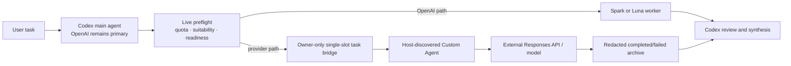

# Architecture

## Boundaries

- Main Codex model/provider/auth are never changed.
- DeepSeek is the default provider pack. MiniMax-M3 and Qwen3.7-Max are the
  second and third built-in packs.
  Additional providers are added as reviewed built-in definitions with tests;
  arbitrary remote pack manifests are intentionally not loaded.
- macOS uses Keychain and the Windows Phase 1 source candidate uses the current
  user's Windows Credential Manager. No plaintext fallback is supported.
- Dry-run is the default; file mutation requires `--apply`.
- Official provider metadata is acquired at install time, never vendored here.
- A Custom Agent's Host identity comes from its official TOML `name` field,
  not from a routing request or preflight role list. See
  [the migration guide](migration/custom-agents.md).
- Cross-provider child execution is enabled only by the exact, version-scoped
  [Host compatibility contract](host-compatibility.md). Native multi-agent
  availability alone is insufficient.

## Provider-neutral transport decision

The formal handoff architecture separates Role, Provider, Model, and Transport.
An already-authorized provider/model tuple may use either a Host-compatible
Native adapter or an isolated External Codex adapter without changing the task,
result, lifecycle, or evidence contract.

```text
Role != Provider != Model != Transport
```

Selection is explainable and fail-closed: provider policy is evaluated first;
an explicit transport either passes or blocks; `auto` prefers a runtime-verified
Native adapter, then a runtime-verified External adapter, otherwise blocks. It
never silently changes provider/model, falls back to OpenAI, pins an older Host,
or uses an explicit-only role.

Phase 3 retains the Phase 2 control-plane boundary in Doctor, Verifier,
Preflight, and Installer: the External registry remains `enabled: false` with
`factory: null`, active routing and the bridge cannot instantiate it, and
Installer `--apply` rejects External activation. A separate maintainer-only
runner can execute one exact, feature-gated, explicitly authorized Flash E2E.
See:

- [Provider-neutral transport contract](transport-contract.md)
- [External Codex transport architecture](external-transport.md)
- [External transport security model](transport-security.md)
- [Phased implementation plan](external-transport-implementation-plan.md)
- [ADR 001](adr/001-external-codex-transport.md)

DeepSeek V4 Flash now has a packaged clean-install External Public Beta backed
by strict local-installation evidence from one controlled production E2E on
exact Codex CLI `0.149.0`. It is not automatic routing or independent-user
evidence.
Native `0.149.x` remains blocked, and other External provider/model tuples remain
unknown.

## Read-only Doctor

`npm run doctor -- --provider <provider>` inspects the local prerequisites
before installation. It checks the platform, Node.js, recognizable Codex state,
Native multi-agent mode and cross-provider Host compatibility, expected name/model/provider,
duplicate or project-scope identities, legacy migration state, owner-only
permissions, OS credential presence, OpenAI fallback hints, installed-manifest
state, and prerequisites for the existing verifier. Phase 2 also reports the
External module, disabled feature gate, exact `codex exec` prerequisite,
isolated runtime-root state, permission profile, provider tuple, credential
readiness, maintainer evidence, local-installation evidence, and eligibility
without creating a runtime root or launching a child.

Doctor performs no writes, never asks the OS credential backend to return a credential value,
does not print private paths, and makes no network or paid provider API call.
An uninstalled worker is reported separately from a blocker such as an invalid
provider, unsupported model, missing credential, or incompatible platform.

## Installed components

### Agent definition

`~/.codex/agents/<provider>_worker.toml` is a user-scoped official Custom
Agent definition. Its TOML `name` is the Host identity; its
`description` and `developer_instructions` are required. It declares the
provider-pack model/provider block and command-backed OS credential authentication.
The Windows Phase 1 definition uses a fixed runtime blocker instead of enabling
Provider execution; Windows Credential Manager currently proves only the secure
configuration foundation.
Those role-level provider values take effect only on a compatible Host; Codex
`0.149.0` ignores them and inherits the parent provider. The installer never
writes `~/.codex/config.toml` or project
`.codex/agents` definitions.

### Runtime catalog

The installer reads the official provider catalog source as inert text (or a local
source for offline mode), enforces a size limit, extracts the pack's reviewed
heredoc or Markdown JSON format, parses JSON, manually follows a bounded redirect
chain while validating every destination against the pack host policy, and applies
pack policy:

- model identity target
- reviewed model policy (V4 Flash is the default DeepSeek fallback; V4 Pro is
  an explicit-only profile and is never auto-routed)
- required source modalities and an installed text-only capability boundary

The resulting catalog is written as owner-only runtime data.

The public project and package slug is `codex-third-party-subagents`. Existing
`codex-third-party-workers` on-disk library, manifest, backup, marker, and bridge
names remain a legacy runtime namespace so upgrades and uninstall stay compatible.

A local catalog or saved setup script can be used for offline installation.

### Live preflight

`~/.codex/bin/subagent-preflight.mjs` first checks the exact Host compatibility
contract. A blocked or unknown Host returns an OpenAI route or deny before
provider readiness checks or bridge creation. On a historically verified Host,
it then reads Codex rate limits through the local Codex app-server, verifies
installed provider files and the selected OS credential backend, and applies the routing policy.
Spark entitlement and live Spark remaining quota are separate inputs. If quota
lookup fails, routing stays on an OpenAI worker.

After policy selects a provider role but before writing a task, preflight checks
every `.codex/agents` layer in the real task-`cwd` ancestor chain. It excludes
only the user's own `~/.codex/agents` user layer. Any project TOML definition or
unreadable layer falls back to OpenAI so custom project-root markers and nested
repositories cannot shadow the validated user identity. Only then does preflight
atomically create the single task bridge; a busy or invalid slot also falls back
to OpenAI.

This is a policy-assisted guardrail. Codex Desktop collaboration calls are not
always guaranteed to be intercepted natively, so the AGENTS rules instruct the
main agent to run preflight before every new spawn or follow-up. It selects an
already-declared Custom Agent role; it does not register or rename a Host agent.

### Task bridge

The bridge root defaults to:

```text
/private/tmp/codex-third-party-worker-task-bridge-<uid>/
```

`active/` is mode `0700`; `active/task.json` is `0600`. The task validates:

- bridge version and `pending`/`running` status;
- task name and normalized final basename;
- absolute working directory and non-empty task message;
- regular-file/directory type, ownership, mode, and absence of symlinks.

Only one task may be active. Completion/failure replaces the active task body with
`[REDACTED]` values for `message` and `cwd`, then atomically renames the
`active` directory to a unique `completed-*` or `failed-*` archive.
Archives are never deleted automatically.

### Install manifest and uninstall

Every managed file records path, installed hash, mode, whether it pre-existed,
and owner-only backup state when needed. Reinstallation preserves backups when
managed files are unchanged. A matching untracked legacy Custom Agent requires
explicit `--migrate-legacy` before adoption; a mismatch, duplicate, or
project-scope conflict stops the apply.

Uninstall validates all actions before writing anything. It removes only exact hash
matches, restores validated backups, and removes only the exact AGENTS marker
block. Any conflict stops the whole uninstall plan.

## Current active Native-path data flow



The External adapter shown in the formal decision documents is still not part
of this active data flow. Phase 2 preflight returns an uppercase Transport
policy decision alongside the existing Native routing result, but only a
Native `ALLOW` may proceed to the existing bridge.

## Verification states

- `configured`: files, permissions, hashes, catalog rules, marker checks, and
  any requested credential check are valid locally; this is independent of the
  current Host contract.
- `discoverable`: local definitions are valid and native multi-agent is on.
- `providerResolved`: the third-party provider has attributable runtime evidence.
- `taskDelivered`: the intended task reached that provider child.
- `runtimeExecuted`: a live provider child task executed.
- `installConfigurationReady`: local managed configuration and the selected OS
  credential check pass. On Windows Phase 1 this can be true while Provider
  runtime remains blocked.
- `configurationReady`: local configuration and Host compatibility both pass;
  it remains false on Windows while runtime is `BLOCKED_PENDING_PHASE_2`.
- `ready`: `configurationReady` plus a verified OS credential. It never
  represents Windows Phase 1 as generally runtime-ready.
- `agentEvidence`: per agent/provider/model local configuration checks with
  a timestamp; it intentionally has no Host runtime metadata.
- `runtimeVerified`: the top-level Native state is not promoted by static
  verification. Phase 2 may represent strict local External Transport evidence
  only inside `transports.external`; result self-report and maintainer evidence
  cannot set it, and the disabled gate keeps External `configurationReady` and
  `ready` false.
- `providerRuntimeReady` / `providerRuntimeStatus`: explicit runtime boundary.
  Windows Phase 1 reports `false` / `BLOCKED_PENDING_PHASE_2` and
  `runtimeVerified=false`.
- `userAccepted`: separate from both local checks and runtime execution.

Verifier output now includes `transport`, `providerId`, `model`,
`evidenceSource`, `hostVersion`, `codexBinary`, `verifiedAt`, and independent
`transports.native` / `transports.external` state. A result envelope is not
accepted as External evidence. Strict maintainer evidence remains separate from
strict local-installation evidence, and the disabled feature gate keeps
External `configurationReady=false` / `ready=false` in Phase 2.
