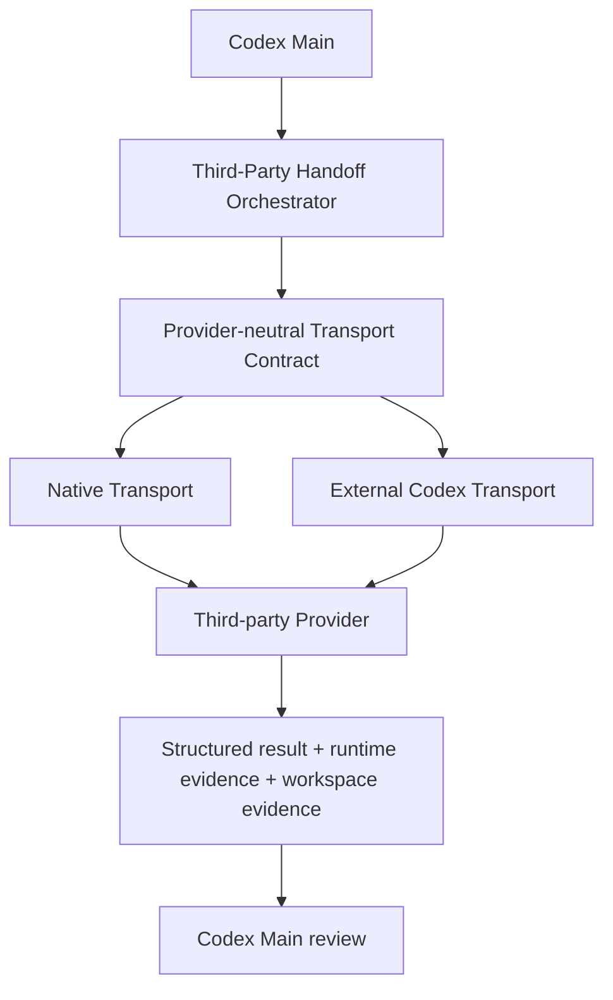

# External Codex transport architecture

Status: Phase 3 controlled Flash production E2E is locally verified. Doctor,
Verifier, Preflight, and Installer understand both Transport states, but the
External registry remains disabled with no factory. No active routing or public
runtime route can reach External execution; only the exact explicit maintainer
gate can.

## Model



Role, provider, model, and transport remain separate. Provider policy authorizes
the third-party tuple; transport policy decides only how that already-authorized
tuple may execute.

## Transport states

### Native

The existing Custom Agent path remains available as an adapter candidate for:

- the exact historical Host contract already runtime-verified by the project;
- a future Host whose cross-provider child contract is explicitly supported and
  then independently runtime-verified.

Codex `0.149.x` Native is `BLOCKED`. `multi_agent=true` never overrides the
[Host compatibility contract](host-compatibility.md).

### External Codex

The External adapter starts an independent `codex exec` process with an isolated
Codex home, provider configuration, task channel, result schema, lifecycle, and
evidence tree. DeepSeek V4 Flash has controlled maintainer fixture evidence on
exact Codex CLI `0.149.0`.

That evidence does not activate production routing, prove a clean public
installation, or represent independent-user acceptance.

### Phase 1 production checkpoint

Phase 1 implements `createExternalCodexTransport(options)` with
`describe`, `prepare`, `execute`, `cancel`, `collect`, and `cleanup`. The
implementation is provider-neutral at its transport boundary and resolves only
provider/model tuples already allowed by the built-in provider packs.

The production modules cover isolated config, launcher/supervision, filesystem
safety, strict result and runtime-evidence parsing, centralized redaction,
owner-only archives, and the single active slot. The registry in
`src/transports/index.mjs` reports `enabled: false` and `factory: null`;
`resolveEnabledTransportFactory("external-codex")` fails with
`EXTERNAL_TRANSPORT_DISABLED`. Direct execution is available only through
dependency-injected local test fixtures and is not a user-facing flag.

Importing, constructing, describing, preparing, or validating the adapter does
not start a child. Production `execute` remains blocked. Phase 1 made no
third-party provider request and did not add a retry path.

### Phase 2 control-plane checkpoint

Phase 2 adds production control-plane descriptors and decisions without
importing the adapter into an active path:

- Doctor reports Native and External readiness separately using read-only,
  non-billable checks;
- Verifier exposes separate Native/External state and accepts only strict
  Transport evidence, never result self-report;
- Preflight evaluates the provider/model tuple, provider policy, explicit-only
  policy, permission, busy state, evidence, and billable authorization;
- Installer dry-run describes `auto|native|external` and rejects External
  `--apply` with a Phase-3-required reason.

The Phase 1 registry still reports `enabled: false` and `factory: null`. The
Phase 2 feature and runtime-route gates are also `false`, and the active bridge
can proceed only after a Native `ALLOW` decision. Phase 2 made zero third-party
Provider requests and does not establish local External runtime verification.

## Adapter sequence

### Prepare

1. Validate the strict transport request.
2. Confirm provider policy and transport eligibility.
3. Resolve and validate `cwd`, expected scope, and permission profile.
4. Reject symlinks or paths that escape the approved workspace.
5. Verify the single External slot is free.
6. Confirm `codex exec`, provider pack, Keychain command contract, result schema,
   and isolated path support without a provider request.
7. Create owner-only scratch state and snapshot parent configuration.

### Execute

1. Generate the minimal provider config inside isolated `CODEX_HOME`.
2. Deliver the bounded envelope over stdin, never argv.
3. Use `read-only` or `workspace-write`; never default to
   `danger-full-access`.
4. Capture PID, timestamps, stdout/stderr, result, and attributable runtime
   metadata.
5. Enforce bounded provider retries, process timeout, and one active child.

### Cancel

Cancellation targets the recorded process group, is idempotent, and never
selects a replacement provider/model/transport. It proceeds through cleanup and
orphan verification even if graceful termination fails.

### Collect

Collection validates three independent evidence classes:

- structured result contract;
- runtime attribution/task/tool evidence;
- workspace before/after scope and test evidence.

It also validates lifecycle, credential scan, archive state, and parent config
immutability. Missing evidence lowers the state; it never infers success from
configuration or result self-report.

### Cleanup

Cleanup redacts task body and `cwd` from the portable archive, atomically
archives completed/failed/timed-out/cancelled state, releases the active slot
only after archive finalization, verifies the process group is gone, and ends
in lifecycle state `closed`. Necessary private evidence remains local in the
owner-only execution tree; normal cleanup preserves the immutable archive and
never copies private evidence into public docs.

## Spike extraction boundary

Phase 1 reimplemented reviewed generic behavior behind the formal contract. No
production module imports `spikes/external-child/**`.

| Spike concern | Production module | Reused concept | Not carried forward |
| --- | --- | --- | --- |
| config | `external-config.mjs` | minimal provider config and command-backed auth | live readiness shortcuts and provider-specific runner state |
| envelope | `transport-contract.mjs`, `external-result.mjs` | strict request validation and stdin prompt | fixture acceptance shortcuts and parent history |
| evidence | `external-evidence.mjs`, `external-redaction.mjs` | attributable session/turn evidence and credential scanning | result self-report as proof and live report evidence |
| filesystem safety | `external-fs-safety.mjs`, `external-archive.mjs` | owner-only paths, scope checks, snapshots, atomic archives | disposable-workspace assumptions and bridge coupling |
| launcher/supervisor | `external-process.mjs` | argv-safe spawn, bounded output, timeout/cancel/process-group cleanup | probe sequencing, hidden retry, and live orchestration |
| result | `external-result.mjs` | strict bounded child result | provider-specific constants and permissive fields |
| collection/snapshots | `external-collection.mjs` | workspace/parent isolation and evidence references | one-off report summaries |

Disposable fixture generation, probe sequencing, report generation, one-off
evidence scripts, live probe orchestration, and `run-spike.mjs` remain Spike-only.

## Isolation and credentials

Each execution has its own:

- `CODEX_HOME` and generated config;
- runtime cache/session state;
- task, result, evidence, log, and archive paths;
- owner-only directory/file permissions.

The child does not inherit user AGENTS, plugins, skills, MCP, hooks, memory,
marketplaces, trust history, or Personal Codex routing. Future additions require
an explicit allowlist and security review.

Authentication is command-backed Keychain-only. Parent never reads the key to
pass it to the child. A provider without a compatible safe auth contract returns
`CREDENTIAL UNSUPPORTED`.

## Permissions

| Profile | Intended use | Writes | Network |
| --- | --- | --- | --- |
| `read-only` | Analysis, research, inspection | None | Provider transport only; task tools disabled from network |
| `workspace-write` | Bounded implementation and tests | Validated `cwd` scope only | Provider transport only; task tools disabled from network |

External paths and additional writable roots are denied. Subprocess execution
uses a minimal environment and remains inside the selected sandbox. A future
high-risk permission mode requires a separate design and explicit user approval.

## Selection

```text
provider policy allowed?
  no -> BLOCK or REQUIRE_EXPLICIT
  yes -> explicit transport requested?
           yes -> validate that transport -> ALLOW or BLOCK/BUSY
           no  -> runtime-verified Native eligible?
                    yes -> Native
                    no  -> runtime-verified External eligible?
                             yes -> External
                             no  -> BLOCK
```

Every decision records requested/selected transport, reason, and compatibility
level. Selection cannot silently change provider/model, downgrade Codex, use
OpenAI, or activate External when installation/project policy forbids it.

## Capability matrix

`Verified` means attributable evidence for that exact transport scope. `Local`
means a non-provider supervisor/contract test. `Historical` is not current Host
support. `Unknown` is fail-closed.

| Provider / model | Transport | Runtime evidence | Text | Read | Write | Shell | Structured result | Streaming | Timeout / cancel | Explicit-only | Verified Host |
| --- | --- | --- | --- | --- | --- | --- | --- | --- | --- | --- | --- | --- |
| DeepSeek V4 Flash | External | **Strict local controlled E2E verified** | Verified | Verified | Verified | Verified | Verified | Observed once; reliability not established | Local contract verified | No; provider policy and explicit gate required | Codex CLI `0.149.0` exact |
| DeepSeek V4 Flash | Native | Historical runtime evidence | Historical | Historical | Unknown | Unknown | Unknown | Unknown | Historical boundary only | No | Codex CLI `0.147.0` exact |
| DeepSeek V4 Pro | Native | Historical controlled read evidence | Historical | Historical | Unknown | Unknown | Unknown | Unknown | Historical boundary only | **Yes** | Codex CLI `0.147.0` exact |
| DeepSeek V4 Pro | External | Unknown | Unknown | Unknown | Unknown | Unknown | Unknown | Unknown | Local supervisor only | **Yes** | None |
| MiniMax M3 | Native | Historical maintainer smoke evidence | Historical | Unknown | Unknown | Unknown | Unknown | Historical provider API evidence only | Unknown | No | Not promoted to a current exact range |
| MiniMax M3 | External | Unknown | Unknown | Unknown | Unknown | Unknown | Unknown | Unknown | Local supervisor only | No | None |
| Qwen3.7-Max | Native | Historical maintainer smoke evidence | Historical | Unknown | Unknown | Unknown | Unknown | Historical provider API evidence only | Unknown | No | Not promoted to a current exact range |
| Qwen3.7-Max | External | Unknown | Unknown | Unknown | Unknown | Unknown | Unknown | Unknown | Local supervisor only | No | None |

The Flash External evidence is the sanitized
[runtime completion record](../spikes/external-child/evidence/runtime-completion-2026-08-23.json).
No other provider receives External eligibility from this record.

## Integration contracts

### Doctor

Doctor output separates Native cross-provider Transport from External module,
feature gate, exact `codex exec` prerequisite, isolated runtime root, permission,
provider tuple, credential readiness, maintainer evidence, local runtime
evidence, and eligibility. It remains read-only and non-billable.

For current `0.149.x`, architecture-level status can be:

```text
Native = BLOCKED
External maintainer evidence = VERIFIED
External local installation = VERIFIED for the exact controlled Flash E2E only
```

### Installer

Dry-run accepts `auto`, `native`, or `external`. Native apply remains governed
by the existing Host compatibility contract. An explicit External dry-run
returns the disabled Phase 2 plan; External `--apply` fails closed before
catalog acquisition, Keychain inspection, or filesystem writes.

### Verifier

Verifier reports `transport`, `evidenceSource`, `hostVersion`, `codexBinary`,
`providerId`, `model`, `credentialReady`, and `verifiedAt` while retaining
configured/providerResolved/taskDelivered/runtimeExecuted/runtimeVerified
semantics. Native and External states are separate. External verification does
not use Native discovery, maintainer evidence, or result provider/model fields
as local runtime proof.

### Preflight

Preflight evaluates task suitability, provider policy, immutable provider/model
tuple, Transport eligibility, explicit-only, busy state, permission,
prerequisites/evidence, and billable authorization, returning `ALLOW`, `BLOCK`,
`REQUIRE_EXPLICIT`, or `BUSY`. Only a Native `ALLOW` may continue to the
existing bridge; every External production decision remains fail-closed.

## Cost boundary

External execution can be billable. Ordinary Doctor/Verifier checks never make
provider requests. Runtime verification must be an explicit entry point marked
`BILLABLE PROVIDER REQUEST`, with bounded timeout/retry and no parallel or Pro
amplification.

## Architecture review

| Review question | Decision |
| --- | --- |
| Is Transport separated from Role/Provider/Model? | Yes. The request carries the tuple unchanged; selection changes only Transport. |
| Can blocked Native execute accidentally? | No. Native eligibility requires the exact runtime-verified Host contract. |
| Does unavailable External fail closed? | Yes. Selection returns `BLOCK`, `REQUIRE_EXPLICIT`, or `BUSY`. |
| Is there silent Provider fallback? | No. Provider policy precedes Transport and the selected tuple is immutable. |
| Must Parent read a plaintext credential? | No. Only Child command-backed Keychain auth is allowed. |
| Is Personal Codex isolated? | Yes. Isolated `CODEX_HOME`, minimal env, no copied personal extensions, and hash snapshots are requirements. |
| Can result JSON prove Provider identity? | No. Runtime session/turn/endpoint evidence is mandatory. |
| Is concurrency one explicit? | Yes. A second External task returns `EXTERNAL CHILD BUSY`. |
| Is Pro explicit-only independent of Transport? | Yes. It is a provider-role policy checked before selection. |
| Can Doctor/Verifier describe both transports? | Yes. The shared evidence states include transport and evidence source. |
| Can future Native support return without redesign? | Yes. It implements the same adapter/request/result/evidence contract. |

No architecture-blocking question remains. Evidence retention UX, the billable
authorization surface, and version-range promotion are phase-owned decisions
whose fail-closed defaults are already fixed in the implementation plan.

See the [transport contract](transport-contract.md),
[security model](transport-security.md),
[implementation plan](external-transport-implementation-plan.md), and
[ADR 001](adr/001-external-codex-transport.md).
